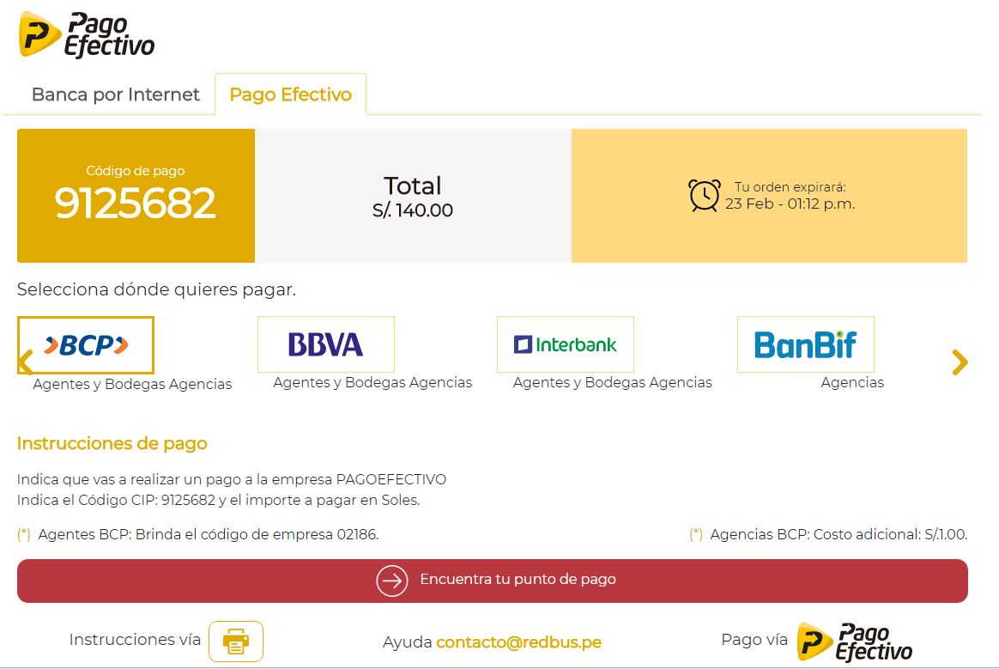
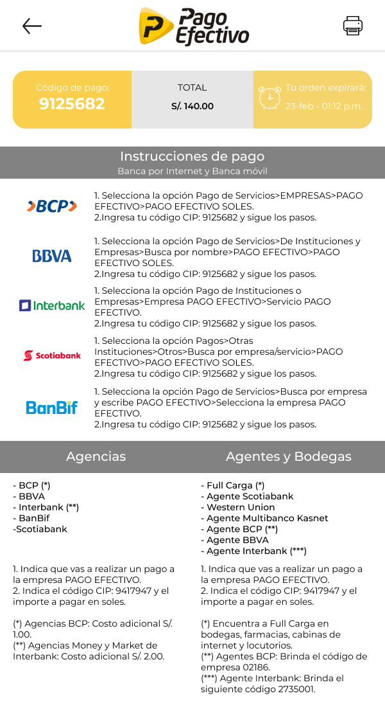
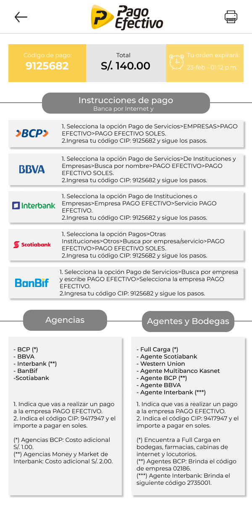
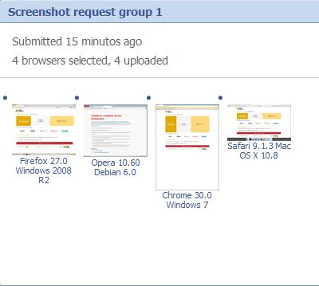
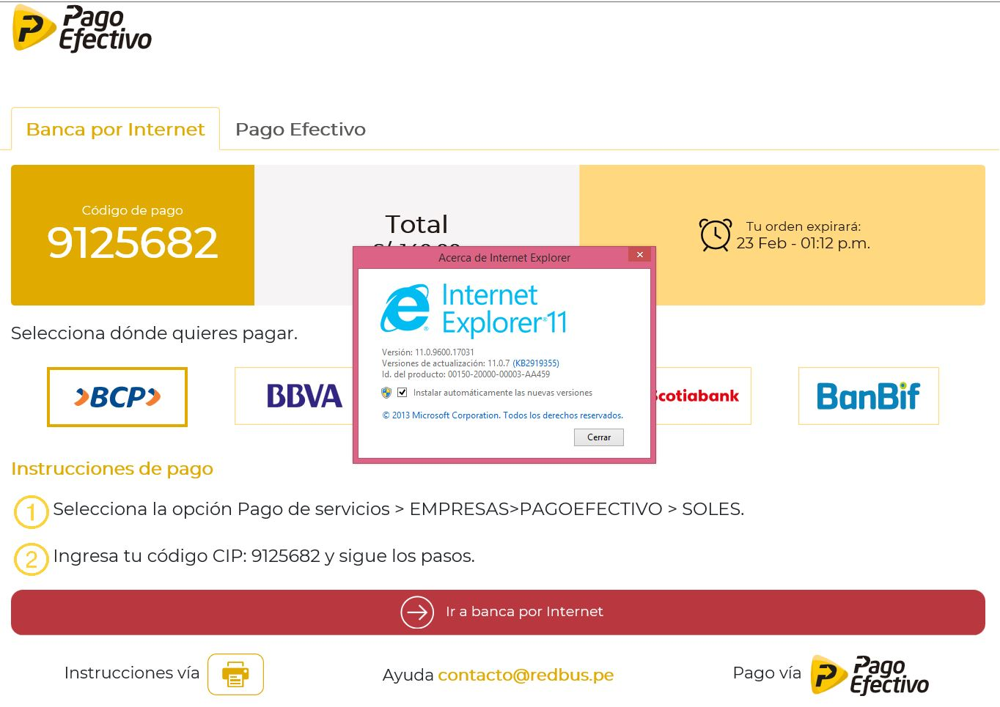
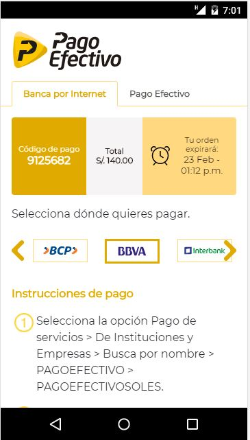
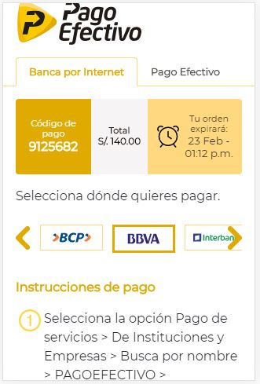
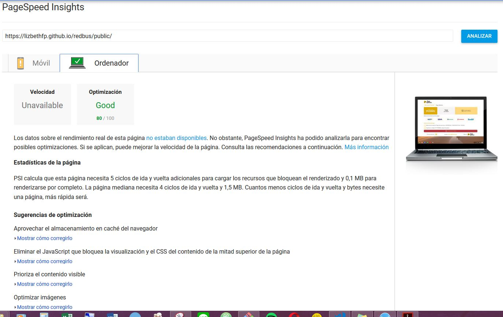
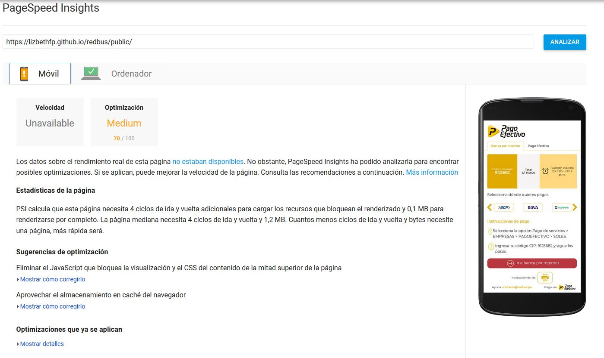

# Reto RedBus

## Objetivo

Maquetar y dar funcionalidad a una página responsiva de confirmación de la pasarela Pago Efectivo, la página brindara mayor conversión a las ventas realizadas en Pago Efectivo y Banca Online.

## Requisitos

La página debe cumplir con los siguientes requisitos funcionales.

[Ver requisitos](doc/retolaboratoria.pdf)

## Prototipo Desktop

[Ver prototipo](https://marvelapp.com/3bij8dc)

### Alta fidelidad

#### Primer diseño

#### Segundo diseño

## No funcionales

### Visualización en navegadores
Testeo realizado con la página [browsershots](http://browsershots.org/)

### Visualización en equipos móviles
Testeo realizado en dispositivos Nexus 5 y iPhone 4

### Testeo de velocidad
Testeo realizado con la página [pagespeed](https://developers.google.com/speed/pagespeed/insights/)

* Resultados para desktop

* Resultados para mobile

### Minificado de CSS y JS
Se utilizó la extensión ES5/ES6 and CSS minifier para Visual Studio Code

